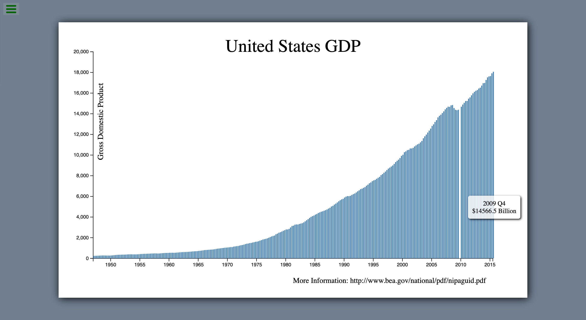

# freeCodeCamp - Visualize Data with a Bar Chart

This is a solution to the [Visualize Data with a Bar Chart](https://www.freecodecamp.org/learn/data-visualization/data-visualization-projects/visualize-data-with-a-bar-chart) on freeCodeCamp.

## Table of contents

- [Overview](#overview)
  - [The challenge](#the-challenge)
  - [Screenshot](#screenshot)
  - [Links](#links)
- [My process](#my-process)
  - [Built with](#built-with)
  - [What I learned](#what-i-learned)
  - [Useful resources](#useful-resources)
- [Author](#author)

## Overview

### The challenge

Users should be able to:

- View the optimal layout for the site depending on their device's screen size
- View United States GDP changes during the past 68 years in a bar chart
- Interact the bar chart to figure out further details in each quarter

### Screenshot

<table>
  <tr>
    <td>
      
    </td>
  </tr>
</table>

### Links

- Live Site URL: [here](https://zun-liang.github.io/fcc-d3-bar-chart)

## My process

### Built with

- HTML
- CSS
- JavaScript
- D3.js
- Mobile-first workflow
- [Vite](https://vitejs.dev/)

### What I learned

- How to use D3.js to build a bar chart
- How to add tooltip in D3.js
- How to add mouseover/mouseout event in D3.js
- How to resize SVG in D3.js

### Helpful Resources

- [d3.js change color and size on line graph dot on mouseover](https://stackoverflow.com/questions/23703089/d3-js-change-color-and-size-on-line-graph-dot-on-mouseover)
- [How to Resize an SVG When the Window is Resized in d3.js](https://chartio.com/resources/tutorials/how-to-resize-an-svg-when-the-window-is-resized-in-d3-js/)

## Author

- Website - [Zun Liang](https://zunldev.com/)
- GitHub - [@zun-liang](https://github.com/zun-liang)
- Frontend Mentor - [@zun-liang](https://www.frontendmentor.io/profile/zun-liang)
- freeCodeCamp - [@zun-liang](https://www.freecodecamp.org/zun-liang)
